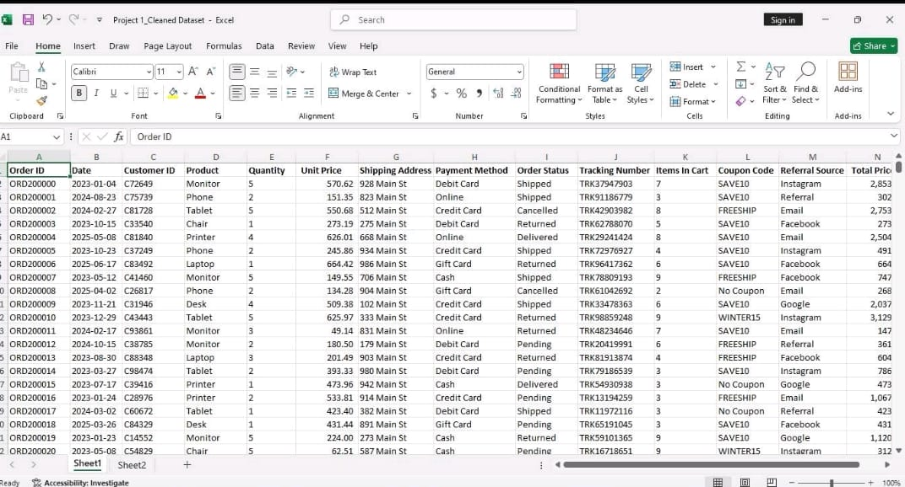
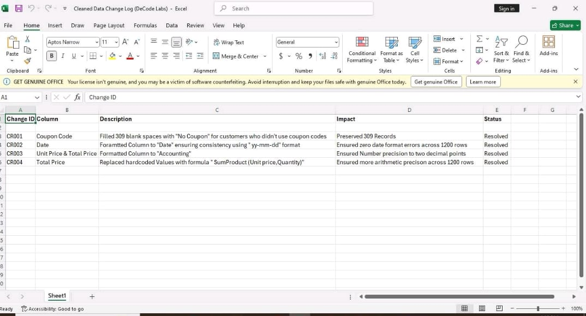

# Project 1 - Data Cleaning & Preparation

## Objective
Clean the raw dataset by handling missing values, removing duplicates, and correcting data formats.

## Tasks Performed
- Identified missing values
- Filled 309 blank Coupon Codes with "No Coupon"
- Standardized Date format
- Formatted Unit Price and Total Price
- Validated Total Price calculations
- Checked duplicate records and IDs

## Tools Used
- Microsoft Excel

## Status
Completed
## Screenshots

### Change Log

### Cleaned Dataset

