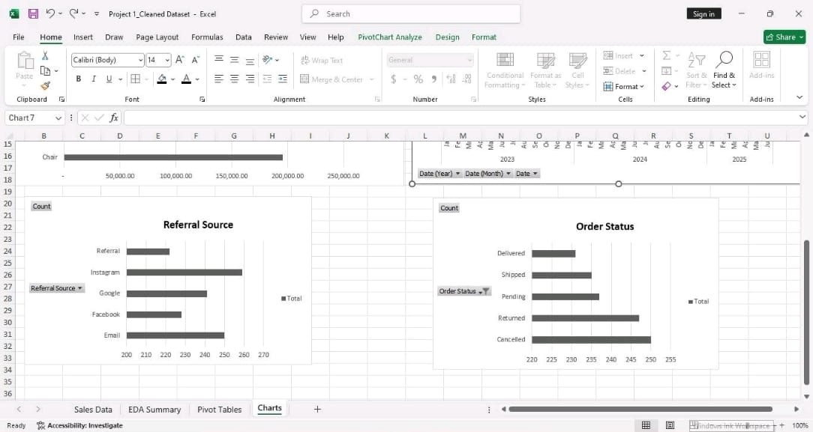
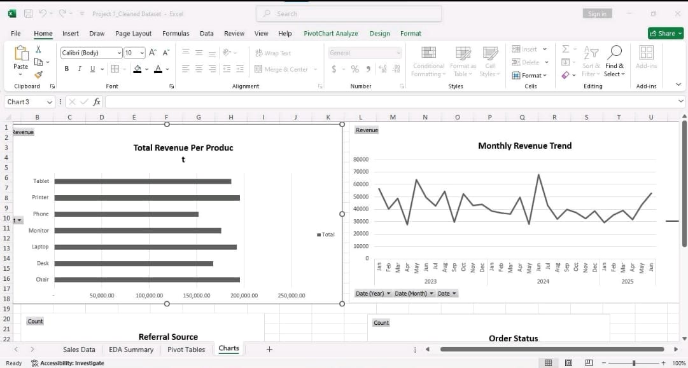
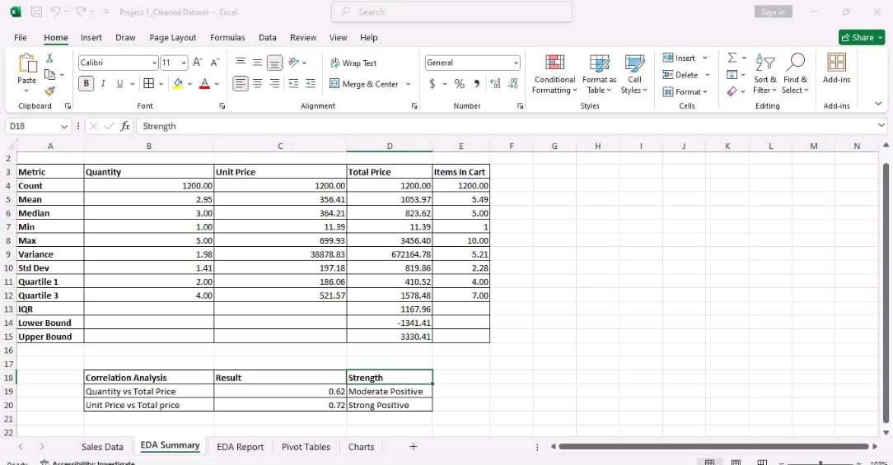
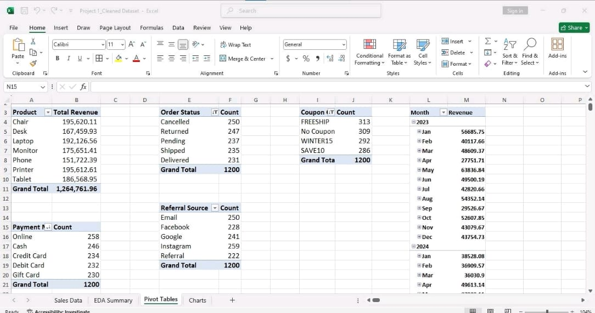

# Project 2 - Exploratory Data Analysis (EDA)

## Objective
Perform Exploratory Data Analysis on the e-commerce dataset to identify trends, patterns, outliers, and business insights.

## Tasks Performed
- Descriptive Statistics
- Product Revenue Analysis
- Payment Method Analysis
- Order Status Analysis
- Referral Source Analysis
- Outlier Detection
- Trend Identification

## Tools Used
- SQL
- Power BI
- Microsoft Excel

## Deliverables
- EDA Report
- SQL Queries
- Dashboard Visualizations

## Status
Completed
## Screenshots

### 1

### 2

### 3

### 4

